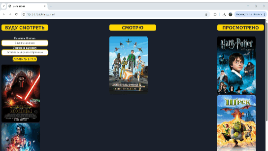
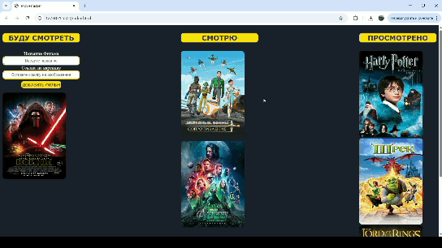
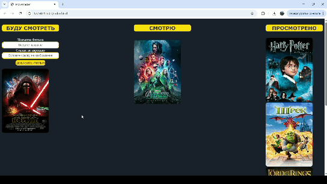

# MovieTracker — личный трекер фильмов!

"Интерактивное веб-приложение для планирования и учета просмотренных фильмов. Позволяет пользователям добавлять любимые кинокартины в список ожидания и распределять их по стадиям просмотра."

## Основные функции (Features):
* **Синхронизация с сервером** — все данные о фильмах подгружаются и сохраняются в реальном времени с помощью REST API (json-server).
* **Интерактивный Drag-and-Drop** — карточки фильмов можно свободно перетаскивать мышкой между колонками.
* **Удобное управление** — добавление новых фильмов через форму с автоочисткой полей после отправки.

## Демонстрация работы (Скриншоты / Анимация)
### 1. Добавление нового фильма
Вводим название, вставляем ссылку на постер, и карточка мгновенно появляется в колонке «Буду смотреть», а форма очищается.

### 2. Перетаскивание карточек (Drag-and-Drop)
Любой фильм можно подхватить мышкой и перенести в соседнюю колонку.

### 3. Распределение по стадиям
Перенос ранее добавленного фильма из начальной колонки в финальную («Просмотрено»).

### 4. Сохранение данных при обновлении
После перезагрузки страницы все карточки остаются на своих новых местах, так как статус обновился на сервере в `db.json`.

## Как запустить проект с нуля (Подробное руководство)

Эта инструкция поможет вам скачать и запустить проект на вашем компьютере, даже если вы никогда раньше не работали с GitHub и терминалом.

### Шаг 1. Подготовка компьютера (Делается один раз)

Для работы приложения и его базы данных вам понадобятся две программы:
1. Node.js — это среда, которая позволит запустить сервер данных на вашем компьютере. Скачайте и установите её с официального сайта: nodejs.org (рекомендуется версия LTS).
2. Visual Studio Code (VS Code) — удобный редактор кода. Скачайте и установите его отсюда: code.visualstudio.com.
После установки VS Code зайдите во вкладку Extensions (Расширения) слева (иконка из четырех квадратиков), найдите в поиске Live Server и нажмите Install.

---

### Шаг 2. Как скачать проект к себе на компьютер

1. Находясь на этой странице репозитория GitHub, поднимитесь наверх и найдите зеленую кнопку Code.
2. Нажмите на неё и в выпадающем меню выберите Download ZIP.
3. Распакуйте скачанный архив в любое удобное место на вашем компьютере (например, на Рабочий стол). Внутри вы увидите общую папку, в которой лежат папка проекта (Movie Tracker) и папка с базой данных (backend).

---

### Шаг 3. Запуск бэкенда (Локального API-сервера)

1. Откройте программу VS Code.
2. В верхнем меню выберите File -> Open Folder... (Файл -> Открыть папку).
3. Выберите и откройте распакованную папку проекта (именно ту часть, где находится сам код фронтенда, файлы index.html и README.md).
4. В верхнем меню VS Code выберите Terminal -> New Terminal (Терминал -> Создать терминал). Внизу экрана откроется командная строка.
5. Скопируйте, вставьте в этот терминал следующую команду и нажмите Enter:

npx json-server ../backend/db.json --port 3000

Терминал автоматически скачает нужные компоненты и запустит базу данных. Не закрывайте этот терминал и не выключайте VS Code, пока работаете с приложением!

---

### Шаг 4. Запуск самого приложения

1. В левой колонке VS Code (в проводнике файлов) найдите файл index.html.
2. Нажмите на него правой кнопкой мыши.
3. В появившемся меню выберите пункт Open with Live Server (Открыть с помощью Live Server).
4. Приложение автоматически откроется в вашем браузере. Вы можете добавлять фильмы, перетаскивать их и обновлять страницу — все данные будут сохраняться на вашем локальном сервере!